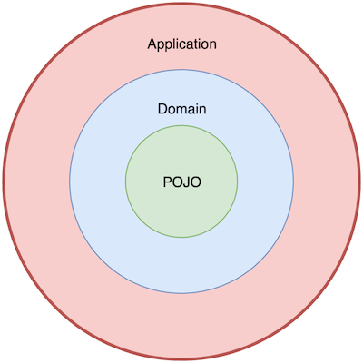

# Functional MobX

This project demonstrates a more functional approach to application
design when using MobX.

## Goals

- Make server-side rendering (SSR) simple.
- Make data-flow clear and easy to reason about.
- Reduce dependency on time and ordering as much as possible.

## Design

The application state is created in layers.

1. The inner core is driven by plain, *old JavaScript objects* (POJOs).
2. The POJOs are lifted into MobX to form the *domain layer*.
3. The *application layer* wraps around the domain layer and provides
   the interface to the outside world.
   

**Advantages:**

- No store/model classes, which makes server-side rendering much simpler.
- Encourages reusable, composable data and functions as opposed to class encapsulation.

**Disadvantages:**

- Might not be familiar to people coming from OOP-style.
- More boilerplate due to domain and UI separation.

### TODOs

- Provide better mechanism for initializing domain state without JSON from SSR. e.g. `fromJS(undefined)`
